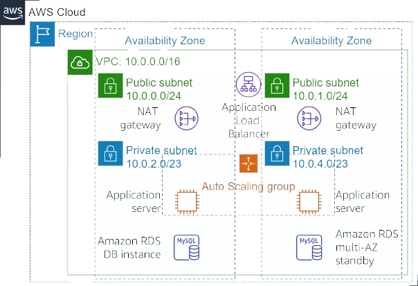
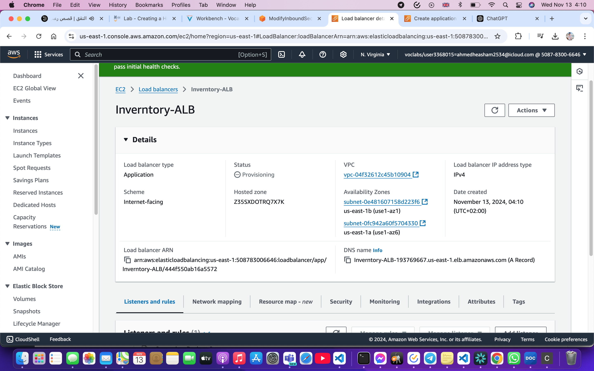
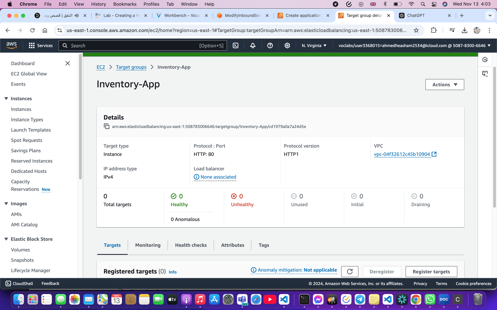
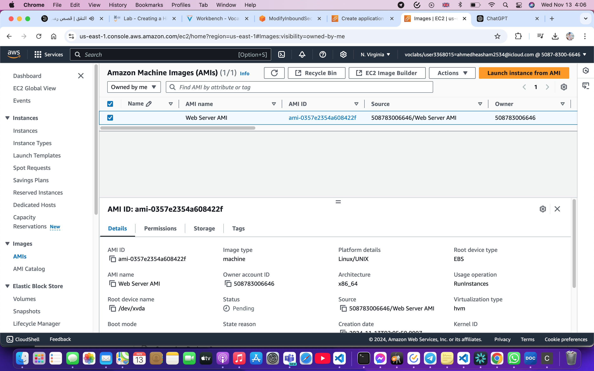
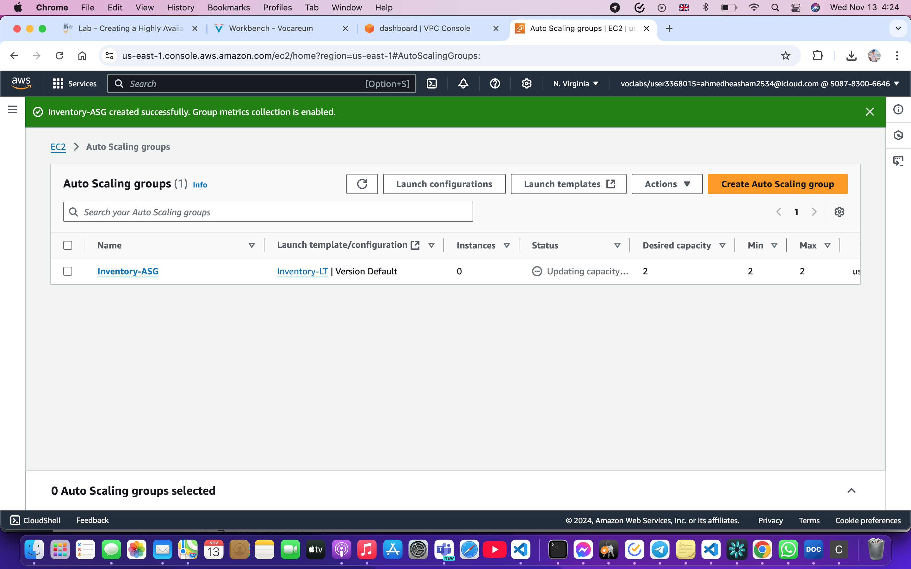
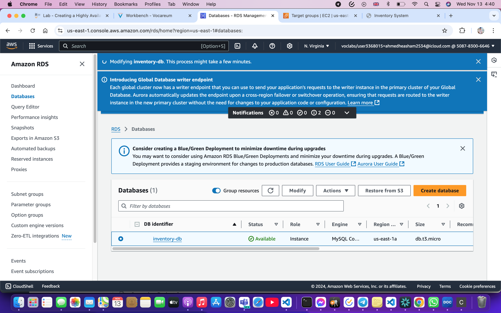
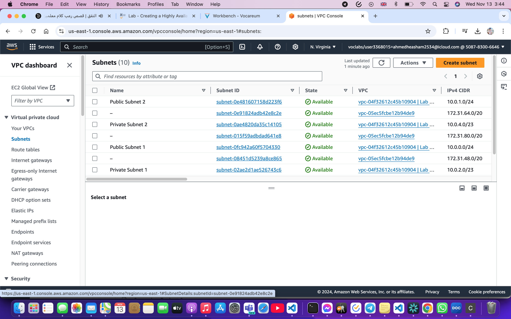
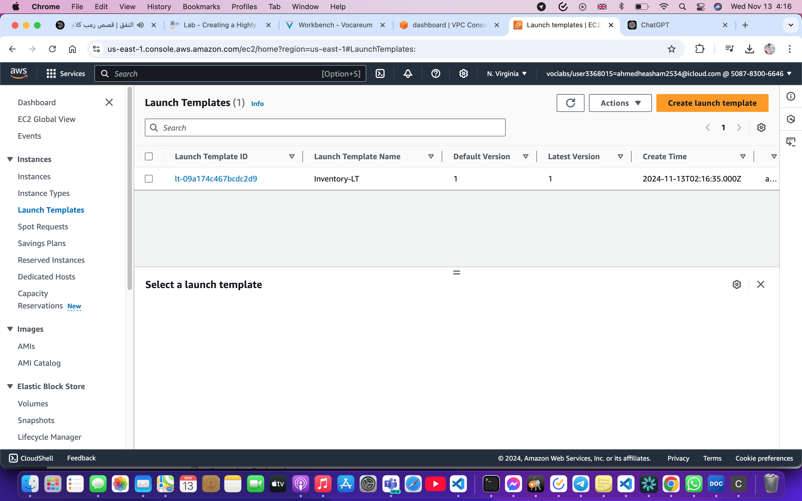
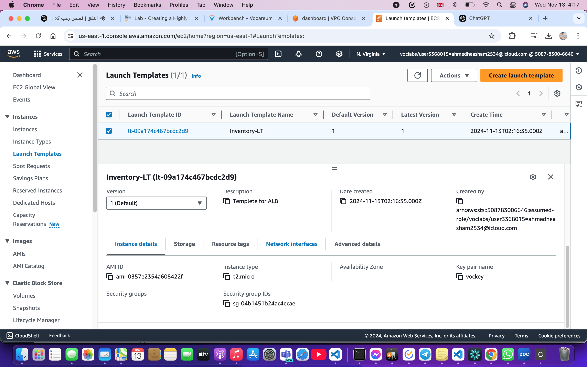

# Inventory-Cloud-System
A highly available and scalable AWS cloud architecture for an inventory system using VPC, public/private subnets, Application Load Balancer, Auto Scaling Group, EC2 instances, and RDS MySQL. Designed with high availability across multiple AZs, secure networking, and automated scaling following AWS best practices.

  

### 🏗️ Architecture Overview
This diagram shows a highly available AWS architecture distributed across multiple Availability Zones. It includes public and private subnets, NAT Gateways, Application Load Balancer, Auto Scaling Group for application servers, and RDS MySQL with Multi-AZ deployment to ensure scalability, fault tolerance, and high availability.

  

### 🌐 Application Load Balancer (ALB)
The Application Load Balancer is configured as internet-facing to distribute incoming HTTP traffic across multiple EC2 instances in different Availability Zones. It improves availability and ensures fault tolerance by routing traffic only to healthy instances.

  

### ✅ Target Group & Health Checks
This image shows the target group configuration where EC2 instances are registered. Health checks are used to monitor instance status, ensuring traffic is only routed to healthy instances, improving system reliability and performance.

  

### 💽 Amazon Machine Image (AMI)
A custom AMI is created from a configured EC2 instance to standardize deployments. This allows quick scaling and ensures consistency across all instances launched in the Auto Scaling Group.

  

### ⚙️ Auto Scaling Group (ASG)
The Auto Scaling Group automatically manages EC2 instances based on demand. It maintains desired capacity, replaces unhealthy instances, and ensures high availability by distributing instances across multiple Availability Zones.

  

### 🗄️ Amazon RDS Database
Amazon RDS MySQL is deployed in a Multi-AZ configuration, providing high availability and automatic failover. The database is placed in private subnets to enhance security and is only accessible from the application layer.

  

### 🌍 Subnets Configuration
The VPC is divided into public and private subnets across multiple Availability Zones. Public subnets host load balancers, while private subnets host application and database layers to ensure secure architecture.

  

### 📦 Launch Template
The launch template defines EC2 instance configurations including AMI, instance type, security groups, and key pairs. It is used by the Auto Scaling Group to launch and manage instances consistently.

  

### 🔧 Launch Template Selection
This shows the selection of the launch template within the Auto Scaling Group, ensuring all instances are launched with predefined configurations for consistency and scalability.

<h1>📖 Case Study</h1>

### 🎯 Problem
Traditional infrastructure lacks scalability and high availability, leading to downtime and poor performance under load.

---

### 💡 Solution
Designed a highly available AWS architecture using:
- Application Load Balancer
- Auto Scaling Group
- Multi-AZ deployment
- RDS MySQL (Multi-AZ)

---

### 🏗️ Architecture
- Public Subnets → ALB
- Private Subnets → App Servers (ASG)
- Private Subnets → RDS Database
- NAT Gateway → Secure outbound access

---

### 🔐 Security
- No direct access to private instances
- Controlled traffic using Security Groups
- Database isolated in private subnet

---

### 🚀 Outcome
- High availability across AZs
- Automatic scaling based on demand
- Fault-tolerant architecture
- Production-ready cloud system

<h1>## 📚 AWS Documentation & Resourcesl</h1>

https://docs.aws.amazon.com/vpc/
https://docs.aws.amazon.com/ec2/
https://docs.aws.amazon.com/autoscaling/
https://docs.aws.amazon.com/elasticloadbalancing/
https://docs.aws.amazon.com/rds/
https://docs.aws.amazon.com/vpc/latest/userguide/vpc-nat-gateway.html
https://docs.aws.amazon.com/vpc/latest/userguide/VPC_Internet_Gateway.html
https://docs.aws.amazon.com/vpc/latest/userguide/VPC_SecurityGroups.html
https://docs.aws.amazon.com/vpc/latest/userguide/vpc-subnets.htm
